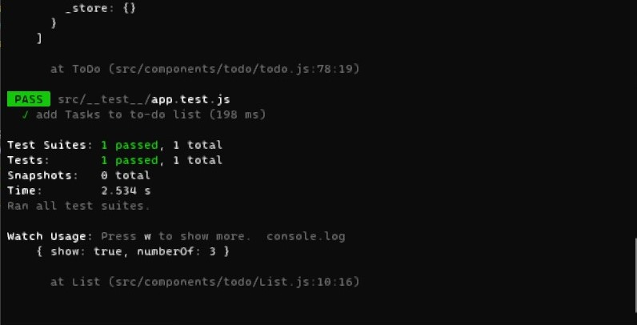
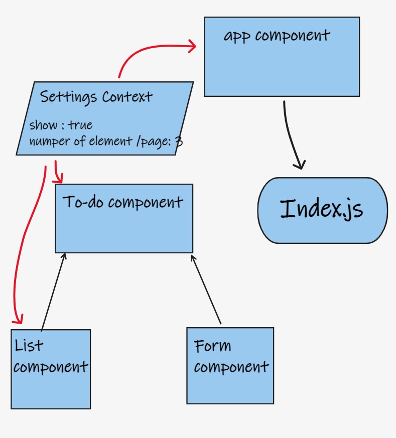

# todo-app

## description

- Create an app to make To-Do list 
- **phase1**
  - Style the application using the Blueprint Component API{target:_blank}

  - Properly modularize the application into separate components

  - Implement the Context API to make some basic application settings available to components
     - How many To Do Items to show at once
     - Whether or not to show completed items

## test

- **phase2**
  - 

## features

- React.js
- blueprintjs.com

## deploy

- **phase1**
  - [netlify](https://dreamy-noyce-582599.netlify.app/)

## UML

- **phase1**

  - 

