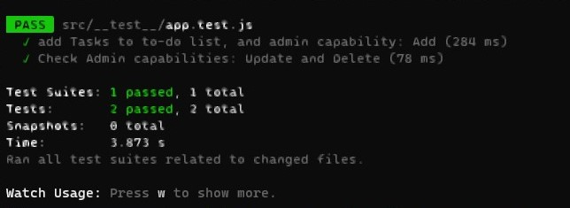
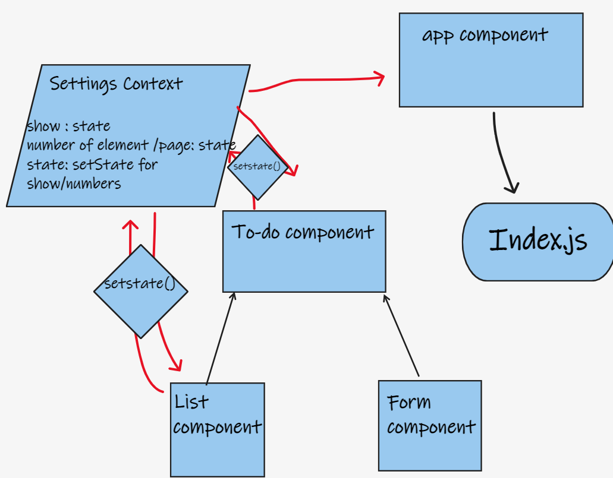
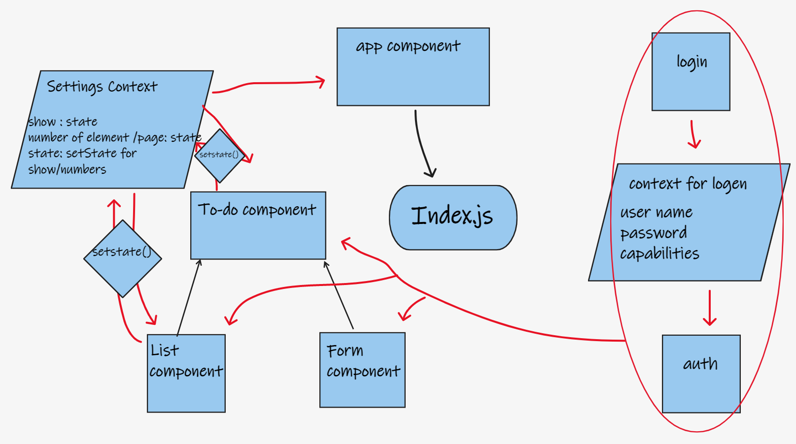

# todo-app

## description

- Create an app to make To-Do list 
- **phase1**
  - Style the application using the Blueprint Component API{target:_blank}

  - Properly modularize the application into separate components

  - Implement the Context API to make some basic application settings available to components
     - How many To Do Items to show at once
     - Whether or not to show completed items

- **phase2**
  - extend the functionality of our application by allowing the user to make some decisions on how they would like the application to function. Specifically, we’ll let them make changes to 2 settings.
    - Save the users choices in Local Storage
    - Retrieve their preferences from Local Storage and apply them to the application on startup

- **phase3**
  - extend the functionality of the application by requiring users be logged in to view items and also restrict access based on user type.
  - **We have thee users `admin`, `editor`, and `writer`.**
    - Logged In Users with ‘read’ permissions can see the summary/count.
    - Logged In Users with ‘read’ permissions can see the list of To Do Items.
    - Logged In Users with ‘update’ permissions can click the records to mark them as complete. 
    - Logged In Users with ‘create’ permissions can create new items.
    - Logged In Users with ‘delete’ permissions can delete items.

## How global state is consumed by the components
- the app using global state via use Context API; useContext() contain the number of the items shown per page and the visibility of the completed tasks as boolean.
## The operation of the hook: useForm()
- useForm is custom hook for managing forms with ease. It takes optional arguments. the app call the add item function by useForm(), then it pass the handel submit/change to the form component to use them on submit button and inputs changes.

## test

- **phase1&2**
  - 

- **phase3**
  -   

## features

- React.js
- blueprintjs.com
- local storage
- React-cookies
- React-If
- JOSN Web Token

## deploy

- **phase1&2&3**
  - [netlify](https://dreamy-noyce-582599.netlify.app/)

## UML

- **phase1**

  - 
  
- **phase2**

  - 

- **phase3**
  
  - 
